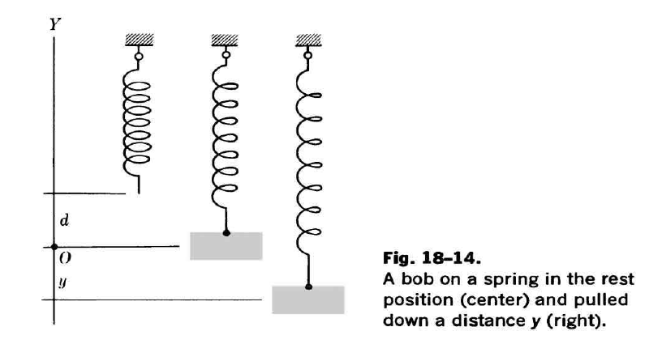

# Day 1, Session 1
### 9:30 – 10:45 am


## Group Introductions

 <!--(9:30–9:50)-->

## Opening Remarks

 <!--(9:50–10:00)-->


<!--

### What this course isn't
- a course on statistics
- a course on signal processing
- an course on programming/Python
- a course on state-of-the-art ML techniques

### What this course focuses on
- finding, combining, and modifying existing tools
- understanding sound as data
- the limits and possibilities of machine learning for sound collections

My philosophy: play and screwing around is a good way to learn

Don't be discouraged. Think of it as a puzzle

Just Goole the error code. If you find yourself getting actually angry, like emotional -- just get up and make a cup of tea. Or come back to it tomorrow.


### Advice at the outset
- Curb your expectations. Don't expect quick results.
 - Frustration is natural. Push through it.


You don't need to understand every single last detail to do useful/interesting things

   But that means you need to be humble


Borrowing and stealing are ok
- both code and audio

The way librarians work and the way tenure-track research faculty work are very different. Every musicologist and ethnomusicologist on the planet (practically) has an enormous collection of illegally acquired music.


It takes a little work every day over the course of years.
- This is an introduction.


Giving you pristine notebooks is too mindless.


There's learning in copying and pasting.

I didn't make intentional mistakes, but I'm sure I made mistakes. When they come up, let's consider fixing the part of the learning process.


We have 20-some hours this week. If I can show you 20 tools in that time and give you some code you can take home and use for your own purposes, I think it'll be time well spent.


We're walking through a lot of pre-written code snippets, but you should take the opportunity to make tweaks and experiment. And ask questions along the way!


If I make a mistake, just pipe up and correct me. I've spent a lot of time working on this stuff, but I hesitate to call myself an expert. In the ideal case, I hope we can all learn from each other here.


The machine won't answer questions for you. It can suggest directions (help you sift), and it can help support arguments you're already making.


ML is a huge field, and we're just going to scratch the surface.


Audio ML is really hard. And it can be really tedious. And it may or may not solve the kinds of problems you want to solve in your work.

Teaching an ML algorithm is like training a child ...
- This discussion includes audio quality: recordings on street, cassette dubs, etc.


But we're going to learn a lot of good stuff about how to think about sound and how to manage and manipulate collections of digital audio files.


Some of the things we're going to do this week are in a way pretty easy, even trivial. But ... baby steps. Everybody starts somewhere.


-->


## Up and running with Docker
<!--(10:00–10:15)-->

Open a new terminal window. On Mac, open the application `Applications/Utilities/Terminal.app`. On a Windows desktop, double click `Docker Quickstart Terminal`.

Before beginning, enter the following command to create a new directory called `sharedfolder` on your desktop. You'll only need to do this once.

```
mkdir ~/Desktop/sharedfolder
```

Now enter the following command to download the pre-built Docker image we'll be using. This should take 5 minutes or so.

```
docker pull stevemclaugh/audio-ml-notebook
```

When the download is complete, enter the following to run the container.

```
docker run -it --name audio_ml_notebook -p 8888:8888 -v ~/Desktop/sharedfolder:/home/sharedfolder stevemclaugh/audio-ml-notebook
```

>For future, reference, the following command will kill all currently running Docker containers.

>```
>rm -f $(docker ps -aq)
>```


> If you're curious, you can view the Dockerfile we're using to build our container here [](https://github.com/stevemclaugh/audio-ml-notebook/blob/master/Dockerfile).

Open your browser and enter `localhost:8888` or `127.0.0.1:8888` in the URL bar. You should see the Jupyter interface. In the upper right, click `New`, then choose `Terminal`.

> If the above does not work on Windows, open a new Docker Quickstart Terminal and enter the command `docker-machine ip`. Enter this IP address, followed by `:8888` in your browser to access Jupyter.

If you like, enter the following line to change the terminal color to green on black.

```
setterm -term linux -back black -fore green -clear
```


## Thinking about sound
<!-- Lecture -->
<!--(10:15–10:45)-->

### What is sound?


<br><br>


<br><br>


<br><br>


[Credit: Wikimedia Commons](https://commons.wikimedia.org/wiki/File:Sine_wave_amplitude.svg)

<br><br>



<!--
You clap your hands, there's some vibration, then it dies away. Just like a bob on a spring.
-->


### Mixing signals

<!-- sound as a linear system, for the most part:

analogy to multiple signals traveling on a fiber optic cable
 -->

<!-- insert image showing additive nature of waves -->


<br><br>


### Harmonic overtones

<!-- one examples of signals being mixed -->


[Credit: Wikimedia Commons](https://commons.wikimedia.org/wiki/File:Harmonic_partials_on_strings.svg)


<br><br>


### From the time domain to the frequency domain


<!--
Any signal we measure can be decomposed into a series of waves at different frequencies, called a Fourier series.
-->


[Credit: Wikimedia Commons](https://commons.wikimedia.org/wiki/File:Square_Wave_Fourier_Series.svg)

<br><br>


[Credit: Wikimedia Commons](https://commons.wikimedia.org/wiki/File:Fourier_Series.svg)


<br><br>


### Digital vs. analog audio


<br><br>


<br><br>


### Bit depth and sample rate


### Timbre
