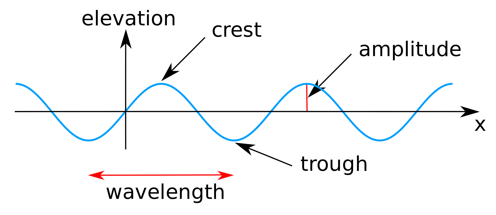
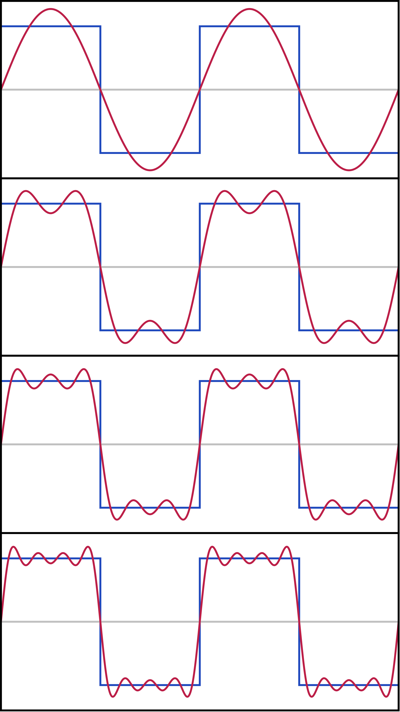
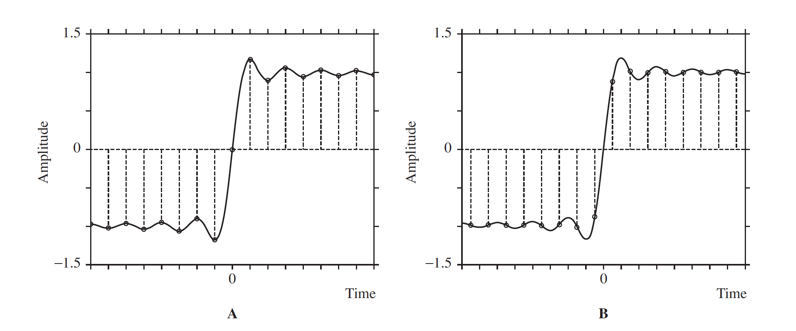
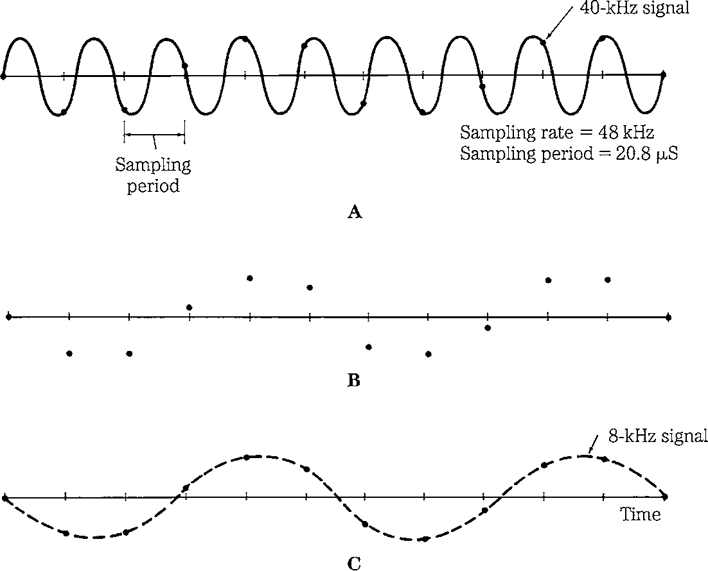

# Day 1, Session 2
### 11:00 am – 12:00 pm

## Thinking about sound
<!-- Lecture -->
<!--(10:15–10:45)-->

### What is sound?

  

  

  

  

[Credit: Wikimedia Commons](https://commons.wikimedia.org/wiki/File:Sine_wave_amplitude.svg)

<!--
You clap your hands, there's some vibration, then it dies away. Just like a bob on a spring.
-->

### Mixing signals

<!-- sound as a linear system, for the most part:

analogy to multiple signals traveling on a fiber optic cable
 -->

<!-- insert image showing additive nature of waves -->

  

### Harmonic overtones

<!-- one examples of signals being mixed -->

[Credit: Wikimedia Commons](https://commons.wikimedia.org/wiki/File:Harmonic_partials_on_strings.svg)

  

### From the time domain to the frequency domain

<!--
Any signal we measure can be decomposed into a series of waves at different frequencies, called a Fourier series.
-->

[Credit: Wikimedia Commons](https://commons.wikimedia.org/wiki/File:Square_Wave_Fourier_Series.svg)

  

[Credit: Wikimedia Commons](https://commons.wikimedia.org/wiki/File:Fourier_Series.svg)

  

### Digital vs. analog audio

  

  

### Bit depth and sample rate

### Timbre

[*>> Forward to 1.4*](1.4.md)
