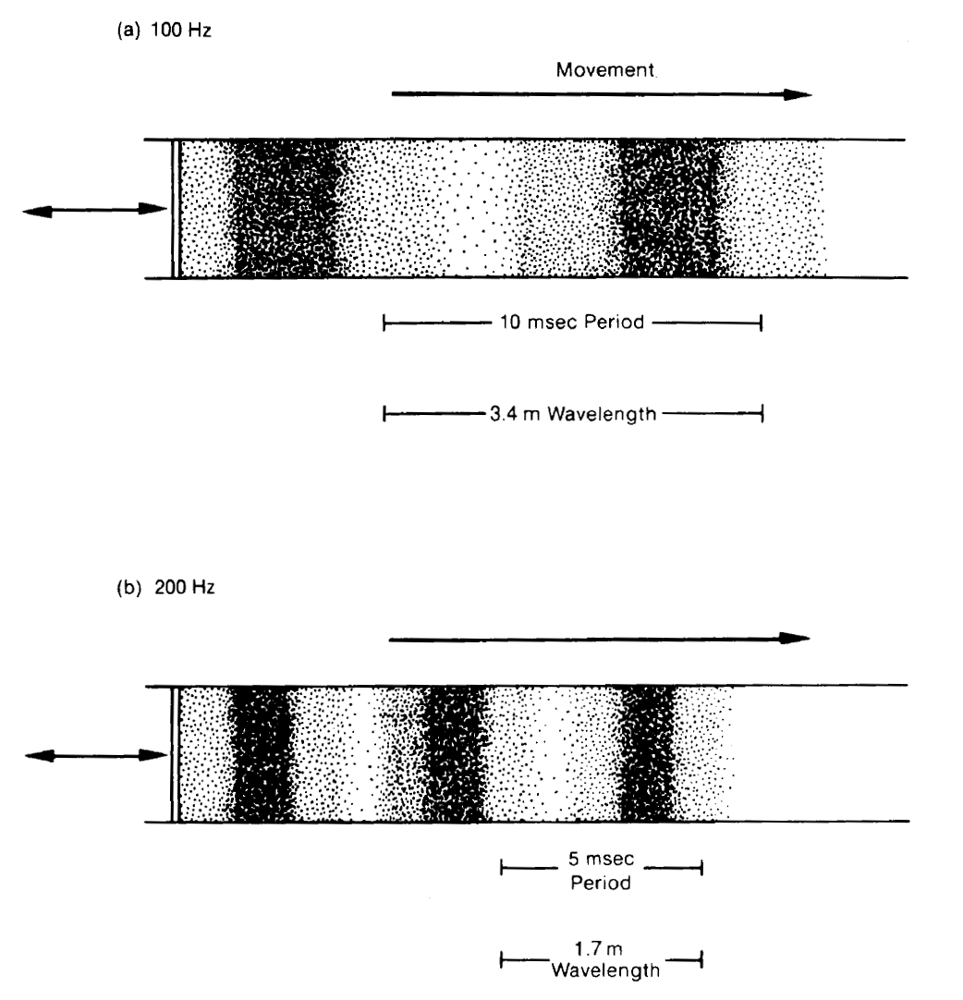
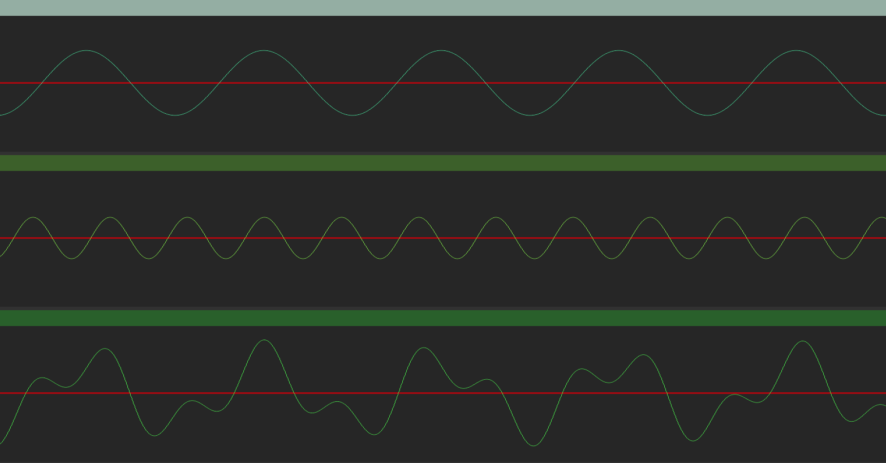
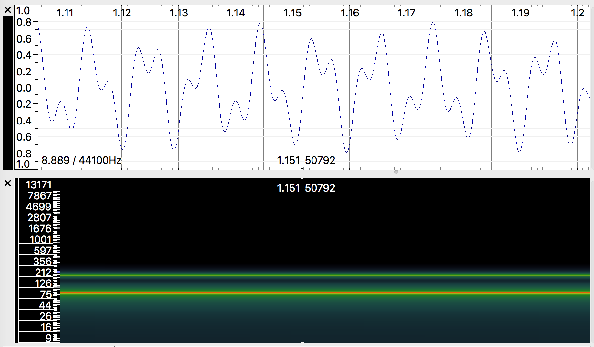
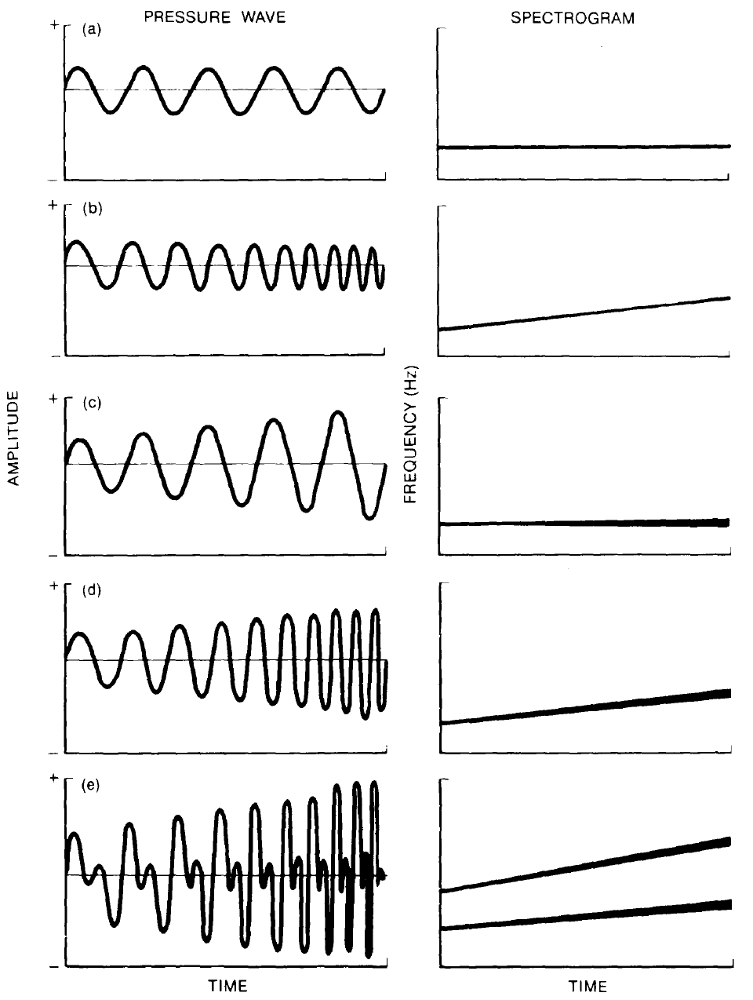
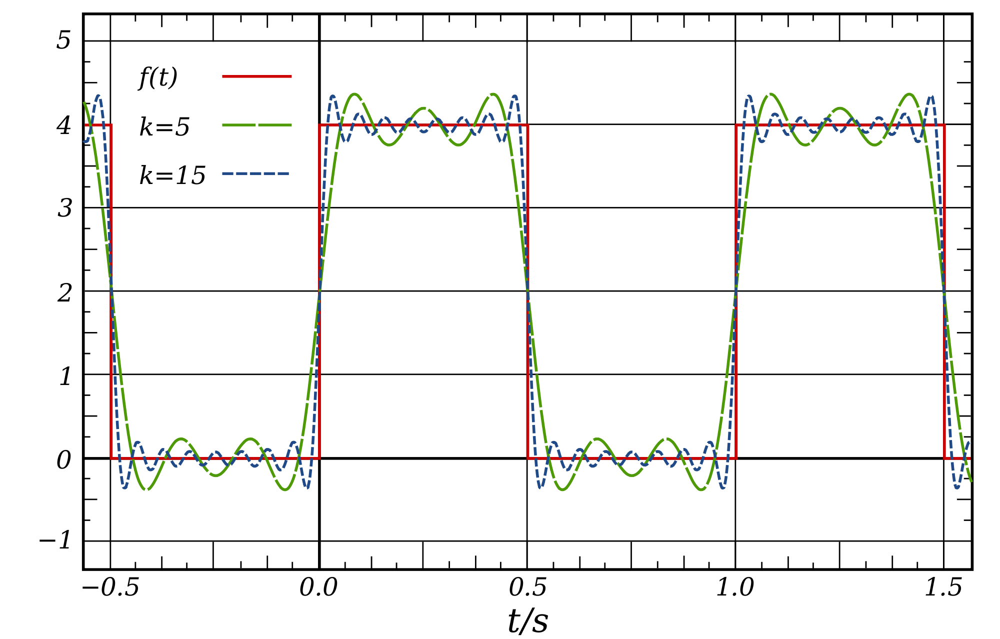

# Day 1, Session 2
### 11:00 am – 12:00 pm

## Understanding sound
<!-- Lecture -->
<!--(10:15–10:45)-->

### What is sound?

  

  

  

  

[Credit: Wikimedia Commons](https://commons.wikimedia.org/wiki/File:Sine_wave_amplitude.svg)

<!--
You clap your hands, there's some vibration, then it dies away. Just like a bob on a spring.
-->

### Mixing signals

<!-- sound as a linear system, for the most part:

analogy to multiple signals traveling on a fiber optic cable
 -->

  

<!-- spectrogram of a pitched instrument -->

<!-- timbre determined (more or less) by the energy of each partial -->

  

### From the time domain to the frequency domain

<!-- one examples of signals being mixed -->

[Credit: Wikimedia Commons](https://commons.wikimedia.org/wiki/File:Harmonic_partials_on_strings.svg)

<!--
Any signal we measure can be decomposed into a series of waves at different frequencies, called a Fourier series.
-->

[Credit: Wikimedia Commons](https://commons.wikimedia.org/wiki/File:Square_Wave_Fourier_Series.svg)

  

[Credit: Wikimedia Commons](https://commons.wikimedia.org/wiki/File:Fourier_Series.svg)

  

### Analog vs. Digital

  

  

### Bit depth and sample rate

- sample rate: The number of audio samples per second in a digital audio file. A file with a sample rate of 44.1kHz contains 44,100 samples per second.

- bit depth: The number of bits used to represent each sample, which corresponds to dynamic range of a given file (i.e., the range of possible "loudness" levels). Each  16-bit audio file

65536

- bit rate: The number of bits per second in a digital

[*<< Back to 1.3*](1.3.md) | [*Forward to 1.4 >>*](1.4.md)
